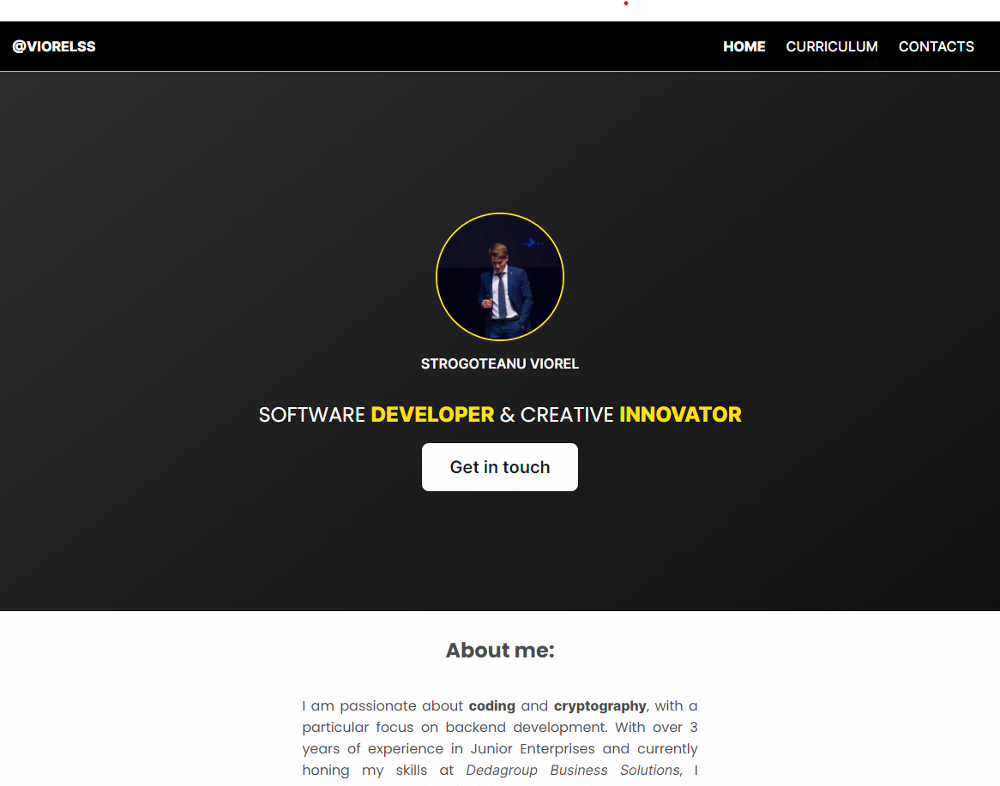

# 🌐 Viorel Strogoteanu's HTML & CSS Project

**Welcome to my HTML & CSS project repository!** 🎉

Here you'll find the source code for a modern and responsive website I developed using **HTML** and **CSS**, with a bit of magic from the **Sass** CSS preprocessor. 

  
*Above: A preview of the project in action!*

---

## 📝 Project Description

This project is all about building a clean, modern, and mobile-first website. I structured the content using HTML and styled it with CSS, enhanced by **Sass** to simplify and organize my code.

### 🎯 **Key Features:**
- **Responsive Design**: Looks great on mobile, tablet, and desktop.
- **Mobile-First Approach**: Prioritizing a seamless mobile experience.
- **Clean, Maintainable Code**: Thanks to the power of Sass with variables, mixins, and nesting.

---

## 🛠️ **Technologies Used**

- **HTML**: Structured the website's content using semantic elements.
- **CSS**: Defined the look and feel of the site, from colors to layout.
- **Sass**: Streamlined CSS writing with variables, mixins, and more advanced features.

---

## 📂 **Project Structure**

- **`index.html`**: The main HTML file that structures the entire website.
- **`styles.scss`**: The Sass file where I wrote all the styling rules.
- **`assets/`**: Contains images and other media used throughout the site.
- **`css/`**: Houses the compiled CSS file generated by Sass.

---

## 🚀 **How to Run the Project Locally**

1. **Clone the repository**:  
   ```bash
   git clone https://github.com/viorel-strogoteanu/progetto-html-css.git
   ```
2. **Open `index.html`** in your favorite browser to view the website locally.

---

## 🌍 **Live Preview**

You can check out the live version of the project here:  
[**Live Website**](https://viorelss.github.io/html-css-s2i/)  


---

## 🤝 **Contributions**

Contributions are always welcome! Feel free to report any bugs or suggest improvements by opening a **pull request**.  

### Want to make the project better?  
1. Fork the repository.  
2. Create a new branch (`feature/some-awesome-feature`).  
3. Commit your changes.  
4. Open a pull request.  


---

Thanks for stopping by! 😄  
Happy coding,  
**Viorel Strogoteanu**  
